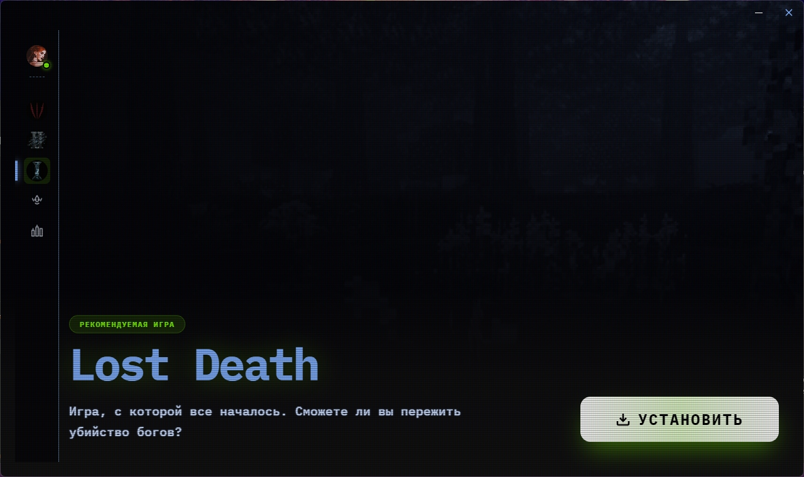
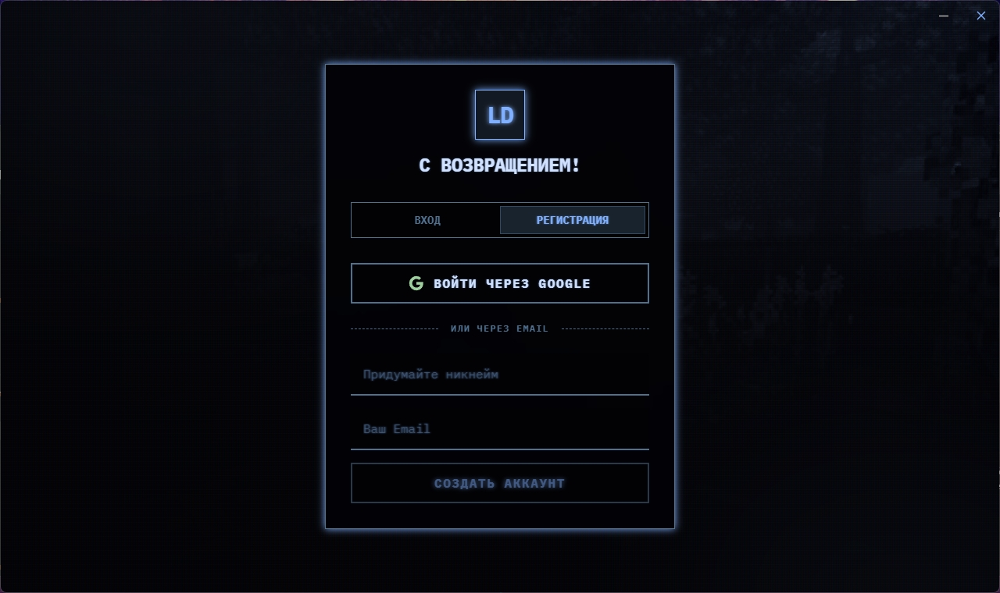
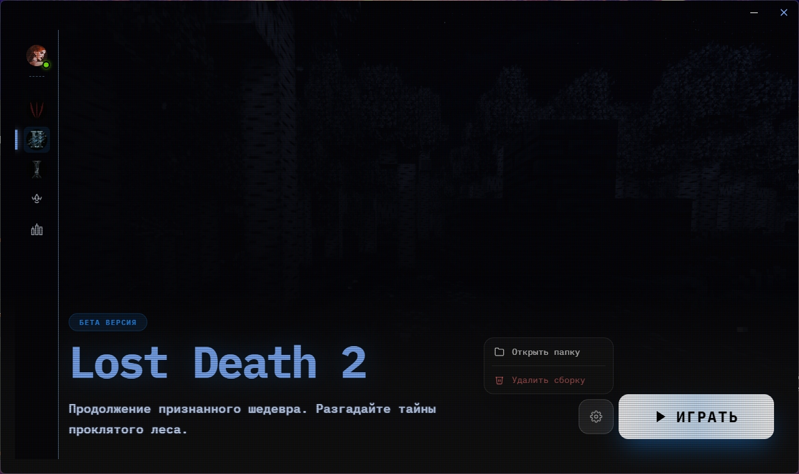

<div align="center">

# ⚔️ LDLauncher

[](https://github.com/LDProjectTeam/LDL/releases)
[](https://github.com/LDProjectTeam/LDL/releases)
[](LICENSE)
[](https://electronjs.org)

<br/>

  

<br/><br/>

🇷🇺 [Русский](#-русский) &nbsp;|&nbsp; 🇬🇧 [English](#-english)

</div>

---

## 🇷🇺 Русский

**Кастомный лаунчер для Minecraft с тёмно-фэнтезийным интерфейсом**

> Профессиональный лаунчер для серии модпаков **Lost Death** с автооптимизатором системы, встроенной поддержкой и уникальным CRT-интерфейсом.

[**⬇️ Скачать**](https://github.com/LDProjectTeam/LDL/releases/latest) &nbsp;·&nbsp; [**🐛 Сообщить о баге**](https://github.com/LDProjectTeam/LDL/issues) &nbsp;·&nbsp; **💬 Поддержка:** ldprojectteams@gmail.com

### ✨ Возможности

| Функция | Описание |
|--------|----------|
| 🎮 **Несколько игр** | Поддержка нескольких инстансов серии Lost Death |
| 🖥️ **CRT Dark-Fantasy UI** | Уникальный интерфейс с анимациями и эффектами |
| ⚙️ **Автооптимизатор** | Определяет мощность ПК и настраивает JVM и RAM |
| 🛡️ **Guard Mod** | Встроенная защита от читов (Fabric Mod) |
| 💬 **Поддержка** | Встроенный чат с командой через Supabase |
| 💳 **Оплата** | Встроенная оплата через Telegram Stars / TON |
| 🌍 **Мультиязычность** | Авто-определение языка системы (RU / EN) |
| 🎵 **Discord RPC** | Отображение активности в Discord |
| 🔄 **Авто-обновление** | Лаунчер устанавливает обновления автоматически |

### 🚀 Установка

1. Перейди в раздел [**Releases**](https://github.com/LDProjectTeam/LDL/releases/latest)
2. Скачай один из вариантов:
   - `LDLauncher_Setup_3.1.0.exe` — Установщик *(рекомендуется)*
   - `LDLauncher_3.1.0.exe` — Портативная версия *(без установки)*
3. Запусти файл — лаунчер сам установит Java, скачает модпак и настроит игру

### 🔧 Сборка из исходников

```bash
cd frontend
npm install
npm run dev        # Запуск в браузере
npm start          # Запуск в Electron
npm run build:exe  # Сборка установщика
```

---

## 🇬🇧 English

**A custom Minecraft desktop launcher with a dark-fantasy interface**

> A professional launcher for the **Lost Death** modpack series, featuring a system auto-optimizer, built-in support chat, and a unique CRT-style interface.

[**⬇️ Download**](https://github.com/LDProjectTeam/LDL/releases/latest) &nbsp;·&nbsp; [**🐛 Report a Bug**](https://github.com/LDProjectTeam/LDL/issues) &nbsp;·&nbsp; **💬 Support:** ldprojectteams@gmail.com

### ✨ Features

| Feature | Description |
|---------|-------------|
| 🎮 **Multiple Games** | Manage multiple instances of the Lost Death series |
| 🖥️ **CRT Dark-Fantasy UI** | Unique interface with smooth animations and effects |
| ⚙️ **Auto-Optimizer** | Detects hardware tier and tunes JVM args & RAM |
| 🛡️ **Guard Mod** | Built-in anti-cheat protection (Fabric Mod) |
| 💬 **Support Chat** | In-app support messaging powered by Supabase |
| 💳 **Payments** | Integrated payment via Telegram Stars / TON |
| 🌍 **Multi-language** | Auto-detects system language (RU / EN) |
| 🎵 **Discord RPC** | Shows launcher activity in Discord |
| 🔄 **Auto-update** | Launcher updates itself automatically |

### 🚀 Installation

1. Go to [**Releases**](https://github.com/LDProjectTeam/LDL/releases/latest)
2. Download one of the following:
   - `LDLauncher_Setup_3.1.0.exe` — Installer *(recommended)*
   - `LDLauncher_3.1.0.exe` — Portable version *(no installation required)*
3. Run the file — the launcher will automatically install Java, download the modpack, and configure the game

### 🔧 Building from Source

```bash
cd frontend
npm install
npm run dev        # Run in browser
npm start          # Run in Electron
npm run build:exe  # Build installer
```

---

## 🛠️ Tech Stack

```
Frontend:  React 18 · TypeScript · TailwindCSS · Framer Motion · Vite
Desktop:   Electron 33
Backend:   Supabase (PostgreSQL · Edge Functions · Auth · Storage)
Mod Guard: Fabric API · Java 17
Build:     electron-builder · NSIS
```

---

## 📜 License / Лицензия

Copyright (c) 2026 **LDProject**. All rights reserved.

This project is proprietary and confidential. Copying, modifying, or distributing this code without written permission from LDProject is strictly prohibited. See [LICENSE](LICENSE) for details.

Данный проект является проприетарным и конфиденциальным. Копирование, изменение или распространение кода без письменного разрешения LDProject строго запрещено.

---

<div align="center">

Made with ❤️ by **LDProject Team**

</div>
