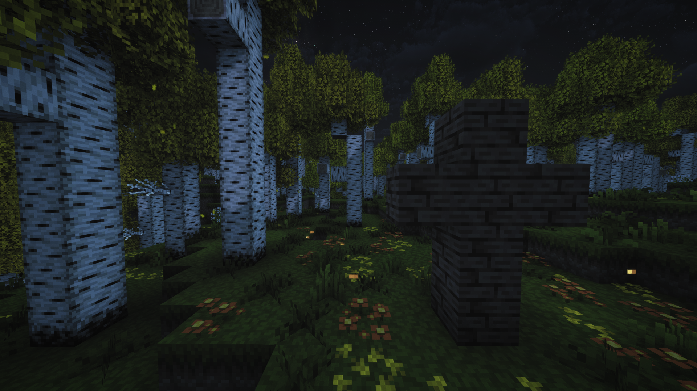

<div align="center">

# ⚔️ LDLauncher

**Кастомный лаунчер для Minecraft с тёмно-фэнтезийным интерфейсом**

[](https://github.com/LDProjectTeam/LDL/releases)
[](https://github.com/LDProjectTeam/LDL/releases)
[](LICENSE)
[](https://electronjs.org)

<br/>

> Профессиональный лаунчер для серии модпаков **Lost Death** с автооптимизатором системы, встроенной поддержкой и уникальным CRT-интерфейсом.

<br/>

[**⬇️ Скачать**](https://github.com/LDProjectTeam/LDL/releases/latest) · [**🐛 Сообщить о баге**](https://github.com/LDProjectTeam/LDL/issues) · [**💬 Поддержка**](mailto:ldprojectteams@gmail.com)

</div>

---

## 📸 Скриншоты

<div align="center">



</div>

---

## ✨ Возможности

| Функция | Описание |
|--------|----------|
| 🎮 **Несколько игр** | Поддержка нескольких инстансов серии Lost Death |
| 🖥️ **CRT Dark-Fantasy UI** | Уникальный интерфейс с анимациями и эффектами в стиле тёмного фэнтези |
| ⚙️ **Автооптимизатор** | Определяет мощность ПК и автоматически настраивает JVM-аргументы и RAM |
| 🛡️ **Guard Mod** | Встроенная защита от читов и несанкционированных клиентов (Fabric Mod) |
| 💬 **Поддержка** | Встроенный чат поддержки с командой, подключённый через Supabase |
| 💳 **Оплата** | Встроенная оплата через Telegram Stars / TON |
| 🌍 **Мультиязычность** | Авто-определение языка системы (RU / EN) |
| 🎵 **Discord RPC** | Отображение активности в Discord |
| 🔄 **Авто-обновление** | Лаунчер проверяет и устанавливает обновления автоматически |

---

## 🚀 Быстрый старт

### 1. Скачать лаунчер

Перейди в раздел [**Releases**](https://github.com/LDProject/LDLauncher/releases/latest) и скачай один из вариантов:

- `LDLauncher_Setup_3.1.0.exe` — Установщик (рекомендуется)
- `LDLauncher_3.1.0.exe` — Портативная версия (без установки)

### 2. Установить и запустить

Запусти скачанный файл. Лаунчер автоматически:
- Установит нужную версию Java
- Скачает выбранный модпак
- Настроит игру под твоё железо

---

## 🛠️ Tech Stack

```
Frontend:  React 18 · TypeScript · TailwindCSS · Framer Motion · Vite
Desktop:   Electron 33
Backend:   Supabase (PostgreSQL · Edge Functions · Auth · Storage)
Mod Guard: Fabric API · Java 17
Build:     electron-builder · NSIS
```

---

## 🔧 Сборка из исходников

> [!IMPORTANT]
> Для сборки требуется разрешение от LDProject. Код защищён проприетарной лицензией.

### Требования
- Node.js v18+
- Java JRE 17+

### Запуск в режиме разработки

```bash
cd frontend
npm install
npm run dev          # Vite dev-server в браузере
npm start            # Запустить в Electron
```

### Сборка установщика

```bash
npm run build:exe    # Сборка + NSIS-установщик
```

Или используй `test.bat` для удобного меню сборки.

---

## 📁 Структура проекта

```
LDLauncher/
├── frontend/
│   ├── src/
│   │   ├── components/     # React компоненты (UI)
│   │   ├── contexts/       # React контексты
│   │   ├── data/           # Данные игр и настроек
│   │   └── i18n.tsx        # Локализация RU/EN
│   ├── electron/
│   │   ├── main.js         # Главный процесс Electron
│   │   ├── preload.js      # Preload-скрипт
│   │   └── managers/       # Менеджеры (установка, запуск, Java, Discord)
│   └── package.json
└── LICENSE
```

---

## 📜 Лицензия

Copyright (c) 2026 **LDProject**. Все права защищены.

Данный проект распространяется под проприетарной лицензией. Любое копирование, изменение, распространение или использование кода без письменного разрешения **LDProject** строго запрещено.

Подробнее: [LICENSE](LICENSE)

---

<div align="center">

Сделано с ❤️ командой **LDProject**

</div>
